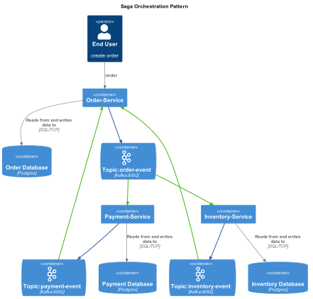

# Saga Choreography Project

## Overview

In monolithic architecture, the entire business logic part of single application, we can modify multiple databases in a
single transaction that allow ACID transactional guarantee. When the business transaction are across the services in
microservice based architecture and single database per microservice then it is difficult as a system to manage the ACID
guarantee.


The above picture when user request for the new order, the request transactions are goes through order service, 
inventory service and payment service to fulfill the order request. If there is a failure in one of this transaction 
steps then it is difficult to guarantee of roll back.

### Resolution
The saga pattern breaks the transaction into sequence of operations that each microservice have to perform on success
and compensation operation to reverse the changes to ensure data consistency.

### Saga Choreography
Services are independently react to events and making decisions based on the event data. Each microservice is the
workflow responsible for sending the event tp the message broker when operation successful and it most trigger the
compensation operation for the previous service in sequence. The event-driven architecture the event published to a 
message broker for the orchestration.



The Order Service receives the request from the client, stores it in the Order database, and publishes an event to the 
"order-event" queue. The Payment Service consumes this event, processes the payment, and publishes a payment credited 
event to the "payment-event" queue. Similarly, the Inventory Service also consumes the event from the "order-event" queue, 
processes the inventory reservation, and publishes an inventory reserved event to the inventory-event queue. The Order 
Service listens to both the "payment-event" queue and the "inventory-event" queue, and based on the payment and inventory
reservation status, it either fulfills the order or rejects it.

The `saga-choreography` project is a multi-module Spring Boot application designed to implement a saga pattern for 
managing distributed transactions across multiple services. This project consists of three main services: 
InventoryService, OrderService, and PaymentService.

## Purpose

The purpose of this project is to demonstrate how to orchestrate complex business processes that span multiple 
microservices using the saga choreography pattern. Each service is responsible for its own domain and communicates 
with other services to complete transactions.

## Modules

### InventoryService
- Manages inventory levels and stock availability.
- Provides APIs to check stock and update inventory.

### OrderService
- Handles order creation and management.
- Interacts with InventoryService to ensure stock availability before processing orders.

### PaymentService
- Manages payment processing for orders.
- Communicates with OrderService to confirm order details before processing payments.

## Setup

To set up the project, follow these steps:

1. **Clone the repository:**
   ```
   git clone <repository-url>
   ```

2. **Navigate to the project directory:**
   ```
   cd saga-choreography
   ```

3. **Build the project:**
   ```
   ./gradlew build
   ```

4. **Run the services:**
   Each service can be run independently. Navigate to the respective service directory and use the following command:
   ```
   ./gradlew bootRun
   ```

## Dependencies

This project uses Gradle as the build tool and includes necessary dependencies for Spring Boot and other libraries required for microservices architecture.

## Contributing

Contributions are welcome! Please submit a pull request or open an issue for any enhancements or bug fixes.